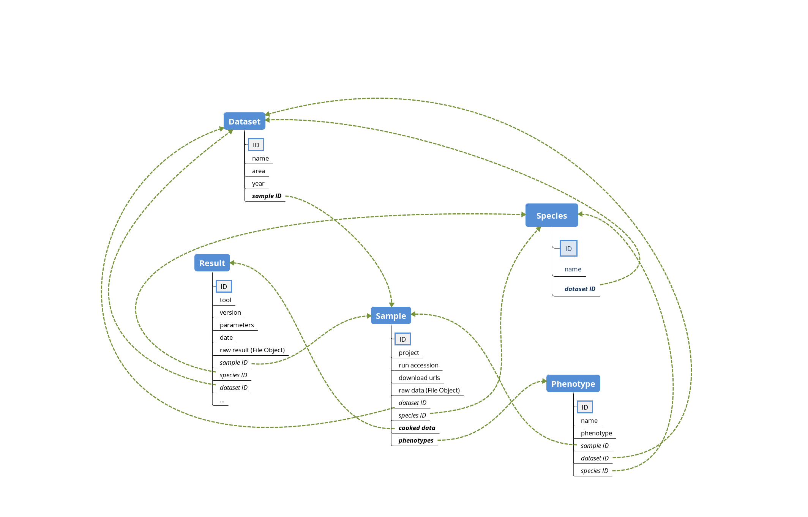

Tutorial
========

DBGen is a general purpose database to support genomic data anlysis studies.
The current implementation is based on mongoDB.

Supported services
---------------------

DBGen has been designed in order to provide user-friendly APIs for typical
bioinformatic workflows. The following functionalities are currently supported:

* extremely simple interface to the database backend
* automatic import of source files containing minimal information
  about biological samples i.e. project name, run accession,
  FTP links to download the genotype, and sample phenotypes (if available)
* automatic download of sample genotypes (using the provided FTP links)
* simple interface to save the results (raw files) of
  any bioinformatic tool
* a collection of methods to query the database efficiently

Backend database
-------------------

Setup
^^^^^^^^

In order to use this package, you need to download, install, and
configure mongoDB on your machine.
You can follow the instructions on the official
`website <https://www.mongodb.com/blog/post/getting-started-with-python-and-mongodb.>`__.

Start and stop the backend
^^^^^^^^^^^^^^^^^^^^^^^^^^^

DBGen provides two methods to start and stop the backend database service,
``dbgen.start_db`` and ``dbgen.shutdown_db``:

.. code:: python

    import dbgen

    configs = dbgen.load_cfg()
    dbgen.start_db(configs)
    ...
    dbgen.shutdown(configs)

Customize DBGen
--------------------

DBGen can be easily configured using command line parameters.
There are 5 user parameters:

* ``--password``: user password
* ``--database``: database name (default: ``dbgen_test``)
* ``--host``: host name (default: ``localhost``)
* ``--port``: port (default: ``27017``)
* ``--root-data-dir``: root directory for input data (default: ``./test/data``)

You can load the configuration parameters directly in python using DBGen.
The method ``load_cfg`` will return an object of class ``argparse.Namespace``:

.. code:: python

    import dbgen

    configs = dbgen.load_cfg()

The ``configs`` object will be required by other DBGen methods to update the database.

DBGen tables
---------------------

The database schema of DBGen is composed of 5 tables:

* ``Species``: the basic unit of classification and a taxonomic rank of an organism
* ``Dataset``: an homogeneous collection of organisms' samples
* ``Sample``: collected individuals
* ``Phenotype``: observable characteristics of a sample
* ``Result``: output result of bioinformatic tools

Workflow
------------

The typical use of DBGen consists of 4 elements:

* load sample data (with the corresponding phenotypes) from source files
* download sample genotype (e.g. fastq files)
* save the results (raw files) of bioinformatic analyzes
  (e.g. VCF files)
* query the database

Load data
^^^^^^^^^^^^^

Once you have loaded the configuration parameters and started the
backend database service,
you are ready to upload data into DBGen.

In order to simplify the insertion of new information, DBGen is designed to scan a user-defined
directory looking for new data. The pre-defined directory is ``./test/data``. You can change
the default directory using the command line parameter ``--root-data-dir``.

In order to work properly, DBGen requires a specific tree structure under
the root data directory:

.. code-block:: text

    root-data-dir
    |
    +-- <species name>
    |   +-- <year>_<publicationName>.txt
    |   +-- <year>_<publicationName>.txt
    |   +-- ...
    |
    +-- <species name>
    |   +-- <year>_<publicationName>.txt
    |   +-- ...
    +-- ...

Each source file must be a TSV (tab-separated values) file with the following columns:

+------------------+-----------------------------------------------------------------+-------------------+-----------------+-----------------+-----+
| **Project name** | **URLs**                                                        | **Run accession** | **Phenotype A** | **Phenotype B** | ... |
+------------------+-----------------------------------------------------------------+-------------------+-----------------+-----------------+-----+
| PRJNA497094      | ftp.baz/SRR8074810_1.fastq.gz;ftp.baz/SRR8074810_2.fastq.gz     | SRR8074810        | R               | S               |     |
+------------------+-----------------------------------------------------------------+-------------------+-----------------+-----------------+-----+
| PRJNA497094      | ftp.baz/SRR8074811_1.fastq.gz;ftp.baz/SRR8074811_2.fastq.gz     | SRR8074811        | R               | S               |     |
+------------------+-----------------------------------------------------------------+-------------------+-----------------+-----------------+-----+

Download sample genotype
^^^^^^^^^^^^^^^^^^^^^^^^^^

DBGen provides a simple method to download samples' genotype.
You just need to specify the name of the species and/or the name
of the dataset you are interested in.

.. code:: python

    dbgen.Sample.download_raw_data(species_name="<species name>", dataset_name="<year>_<publicationName>")

Save bioinformatic results
^^^^^^^^^^^^^^^^^^^^^^^^^^^^^^

Once you have obtained the results a bioinformatic pipeline, you can
easily import the results inside DBGen using the ``save_result`` method.

.. code:: python

    dbgen.Sample.save_result(sample_id=sample_primary_key,
                             tool_name="<tool name>",
                             version="<tool version>",
                             date="<current date>",
                             parameters="<tool parameters>",
                             raw_result_path="</path/to/result/file>")

Query the database
^^^^^^^^^^^^^^^^^^^^^^^

There are 6 basic methods available in DBGen to query the database:

* ``get_phenotype_names``: get the set of phenotype names
* ``get_tool_names``: get the set of bioinformatic tool names
* ``get_download_urls``: get samples' URLs used to download their genotype
* ``get_raw_data``: get samples' genotype (e.g. fastq files)
* ``get_phenotypes``: get the observed samples' phenotype
* ``get_results``: get the results of bioinformatic analyzes

The first two methods return a python ``set`` of strings.
The last four methods, instead, return a pandas ``DataFrame``.

Get phenotype names
*******************

You can get the list of available
phenotypes using the ``get_phenotype_names`` method.
You just need to specify the name of the species and/or the name
of the dataset you are interested in.

.. code:: python

    dbgen.Phenotype.get_phenotype_names(species_name="<species name>", dataset_name="<year>_<publicationName>")

The method will return a python ``set`` of strings, i.e.:

.. code:: python

    ('<phenotype name 1>', '<phenotype name 2>', '<phenotype name 3>', ...)

Get tool names
*******************

You can get the list of
tools used so far using the ``get_tool_names`` method.
You just need to specify the name of the species and/or the name
of the dataset you are interested in.

.. code:: python

    dbgen.Result.get_tool_names(species_name="<species name>", dataset_name="<year>_<publicationName>")

The method will return a python ``set`` of strings, i.e.:

.. code:: python

    ('<tool name 1>', '<tool name 2>', '<tool name 3>', ...)

Get raw genotype
**************************

You can get the raw genotype
of samples using the ``get_raw_data`` method.
You just need to specify the name of the species and/or the name
of the dataset you are interested in.

.. code:: python

    dbgen.Sample.get_raw_data(species_name="<species name>", dataset_name="<year>_<publicationName>")

The method will return a pandas ``DataFrame``, e.g.:

+------------------------+-------------+-------------------+---------------+-------------+------------------------+
| **Sample primary key** | **Project** | **Run accession** | **Species**   | **Dataset** | **Genotype files**     |
+------------------------+-------------+-------------------+---------------+-------------+------------------------+
| 652g6736f37719hbd      | PRJEB5225   | ERR410034         | Staph. Aureus | 2009_Austin | [<RawFile>, <RawFile>] |
+------------------------+-------------+-------------------+---------------+-------------+------------------------+
| dug36ij3db73d8h92      | PRJEB5225   | ERR410035         | Staph. Aureus | 2009_Austin | [<RawFile>, <RawFile>] |
+------------------------+-------------+-------------------+---------------+-------------+------------------------+
| ...                    | ...         | ...               | ...           | ...         | ...                    |
+------------------------+-------------+-------------------+---------------+-------------+------------------------+

The last column will contain the raw genotype of each sample.
If you want to access the file, you can use the following procedure:

.. code:: python

    results = dbgen.Sample.get_raw_data(dataset_name="2009_Austin")

    # get the first genotype file of the first sample
    raw_data = results.iloc[0, -1][0]

    # save the file locally so that
    # it can be processed by bioinformatics tools
    with open(raw_data.name, "wb") as f:
        raw_bytes = raw_data.file.read()
        f.write(raw_bytes)

Get genotype URLs
*******************

You can get the list of URLs used to download the genotype
of samples using the ``get_download_urls`` method.
You just need to specify the name of the species and/or the name
of the dataset you are interested in.

.. code:: python

    dbgen.Sample.get_download_urls(species_name="<species name>", dataset_name="<year>_<publicationName>")

The method will return a pandas ``DataFrame``, e.g.:

+------------------------+-------------+-------------------+---------------+-------------+--------------------------------------------------------------+
| **Sample primary key** | **Project** | **Run accession** | **Species**   | **Dataset** | **Genotype files**                                           |
+------------------------+-------------+-------------------+---------------+-------------+--------------------------------------------------------------+
| 652g6736f37719hbd      | PRJEB5225   | ERR410034         | Staph. Aureus | 2009_Austin | [ftp.baz/ERR410034_1.fastq.gz, ftp.baz/ERR410034_2.fastq.gz] |
+------------------------+-------------+-------------------+---------------+-------------+--------------------------------------------------------------+
| dug36ij3db73d8h92      | PRJEB5225   | ERR410035         | Staph. Aureus | 2009_Austin | [ftp.baz/ERR410035_1.fastq.gz, ftp.baz/ERR410035_2.fastq.gz] |
+------------------------+-------------+-------------------+---------------+-------------+--------------------------------------------------------------+
| ...                    | ...         | ...               | ...           | ...         | ...                                                          |
+------------------------+-------------+-------------------+---------------+-------------+--------------------------------------------------------------+

The last column will contain the list of URLs to download
the genotype of each sample.

Get phenotypes
*******************

You can get samples' phenotypes using the ``get_phenotypes`` method.
You just need to specify and/or:

* the name of the species
* the name of the dataset

plus the name of the phenotype you are interested in.

.. code:: python

    dbgen.Phenotype.get_phenotypes(species_name="<species name>",
                                   dataset_name="<year>_<publicationName>",
                                   phenotype_name="<name of the phenotype>")

The method will return a pandas ``DataFrame``, e.g.:

+------------------------+---------------+-------------+---------------+
| **Sample primary key** | **Species**   | **Dataset** | **Mupirocin** |
+------------------------+---------------+-------------+---------------+
| 652g6736f37719hbd      | Staph. Aureus | 2009_Austin | R             |
+------------------------+---------------+-------------+---------------+
| dug36ij3db73d8h92      | Staph. Aureus | 2009_Austin | S             |
+------------------------+---------------+-------------+---------------+
| ...                    | ...           | ...         | ...           |
+------------------------+---------------+-------------+---------------+

The last column will contain the observed phenotype for each sample.

Get results
*******************

You can get the results of bioinformatic pipelines
using the ``get_results`` method.
You just need to specify the name of the species and/or the name
of the dataset you are interested in.

.. code:: python

    dbgen.Sample.get_download_urls(species_name="<species name>",
                                   dataset_name="<year>_<publicationName>")

The method will return a pandas ``DataFrame``, e.g.:

+------------------------+---------------+-------------+------------+-------------+----------------+---------------+
| **Sample primary key** | **Species**   | **Dataset** | **Tool**   | **Version** | **Parameters** | **Result**    |
+------------------------+---------------+-------------+------------+-------------+----------------+---------------+
| 652g6736f37719hbd      | Staph. Aureus | 2009_Austin | AMRFinder+ | 1.0.0       | -l 20          | <File Object> |
+------------------------+---------------+-------------+------------+-------------+----------------+---------------+
| dug36ij3db73d8h92      | Staph. Aureus | 2009_Austin | BLASTn     | 0.8.0       | -p 0.2         | <File Object> |
+------------------------+---------------+-------------+------------+-------------+----------------+---------------+
| dug36ij3db73d8h92      | Staph. Aureus | 2009_Austin | AMRFinder+ | 1.1.2       | -l 30 -k 24    | <File Object> |
+------------------------+---------------+-------------+------------+-------------+----------------+---------------+
| ...                    | ...           | ...         | ...        | ...         | ...            | ...           |
+------------------------+---------------+-------------+------------+-------------+----------------+---------------+

The last column will contain a file object containing
the result of each bioinformatic tool.

Examples
--------------------

Some working examples are presented in this section.
Consider the following directory structure.

.. code-block:: text

    ./test/data
    |
    +-- species1
    |   +-- 2010_AuthorName1.txt
    |
    +-- species2
        +-- 2009_AuthorName3.txt
        +-- 2011_AuthorName3.txt

.. code:: python

    import os
    import sys
    import dbgen

    def test_dbgen():

        # load configuration and connect to the backend database
        configs = dbgen.load_cfg()
        dbgen.start_db(configs)
        dbgen.connect_db(configs)

        # load source data
        dbgen.import_data(configs)

        # some queries
        s1 = dbgen.Sample.get_raw_data(species_name="species2", dataset_name="2009_AuthorName3")
        s2 = dbgen.Sample.get_raw_data(dataset_name="2009_AuthorName3")
        s3 = dbgen.Sample.get_raw_data(species_name="species2")
        u1 = dbgen.Sample.get_download_urls(dataset_name="2009_AuthorName3")
        u2 = dbgen.Sample.get_download_urls(species_name="species2")
        u3 = dbgen.Sample.get_download_urls(species_name="species2", dataset_name="2009_AuthorName3")
        p0 = dbgen.Phenotype.get_phenotype_names(species_name="species2")
        p1 = dbgen.Phenotype.get_phenotypes(species_name="species2", phenotype_name="Mupirocin")
        p2 = dbgen.Phenotype.get_phenotypes(dataset_name="2009_AuthorName3", phenotype_name="Mupirocin")
        p3 = dbgen.Phenotype.get_phenotypes(species_name="species2",
                                            dataset_name="2009_AuthorName3",
                                            phenotype_name="Mupirocin")

        # download samples' genotype
        dbgen.Sample.download_raw_data(species_name="species2", dataset_name="2009_AuthorName3")

        # get raw genotype
        s1 = dbgen.Sample.get_raw_data(species_name="species2", dataset_name="2009_AuthorName3")
        s2 = dbgen.Sample.get_raw_data(dataset_name="2009_AuthorName3")
        s3 = dbgen.Sample.get_raw_data(species_name="species2")

        # save a local genotype file
        raw_data = s1.iloc[0, -1][1]
        with open(raw_data.name, "wb") as f:
            raw_bytes = raw_data.file.read()
            f.write(raw_bytes)

        # pretend to run a bioinformatic pipeline
        # on some samples and save the results
        # into DBGen
        root_path = "./test/db/cooked/"
        if not os.path.exists(root_path):
            os.makedirs(root_path)
        for k, v in s1.iterrows():
            tool_name = "AMRFinder+"
            version = "0.0.1"
            date = "2019-09-02"
            parameters = "-c 20 -v 39"
            file_path = os.path.join(root_path, "testfile_%s.txt" % v["run accession"])
            raw_result = open(file_path, "w")
            raw_result.write("Hello %s" % v["run accession"])
            raw_result.write("This is our new text file")
            raw_result.write("and this is another line.")
            raw_result.write("Why? Because we can.")
            raw_result.close()
            raw_result_path = os.path.abspath(file_path)

            dbgen.Sample.save_result(k, tool_name, version,
                                     date, parameters, raw_result_path)

        # query the result table
        res0 = dbgen.Result.get_results(species_name="species2", dataset_name="2009_AuthorName3")
        res1 = dbgen.Result.get_results(species_name="species2")
        res2 = dbgen.Result.get_results(dataset_name="2009_AuthorName3")

        # shutdown the database backend
        dbgen.shutdown_db(configs)

        return

